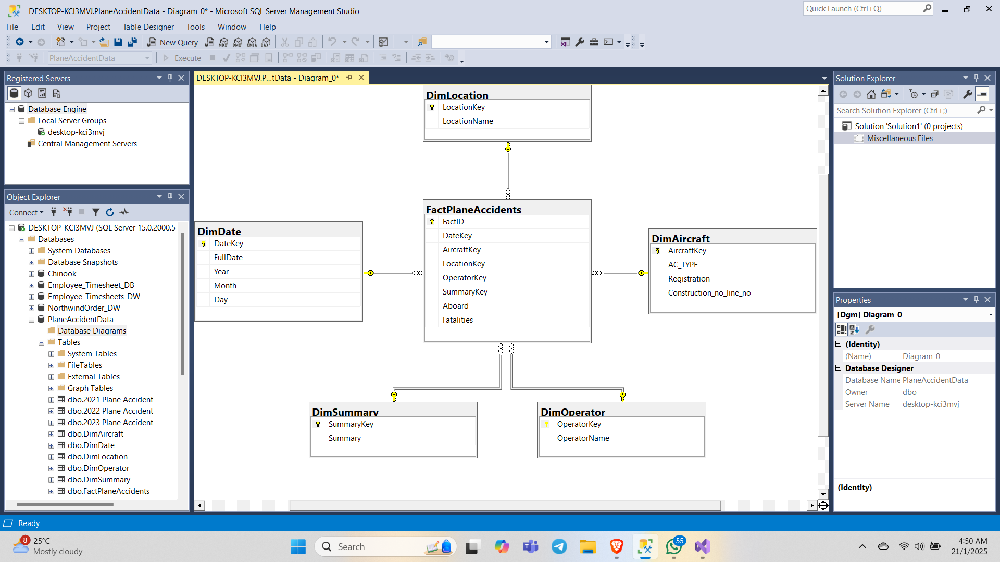
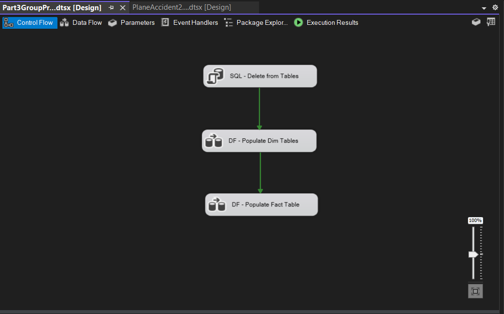
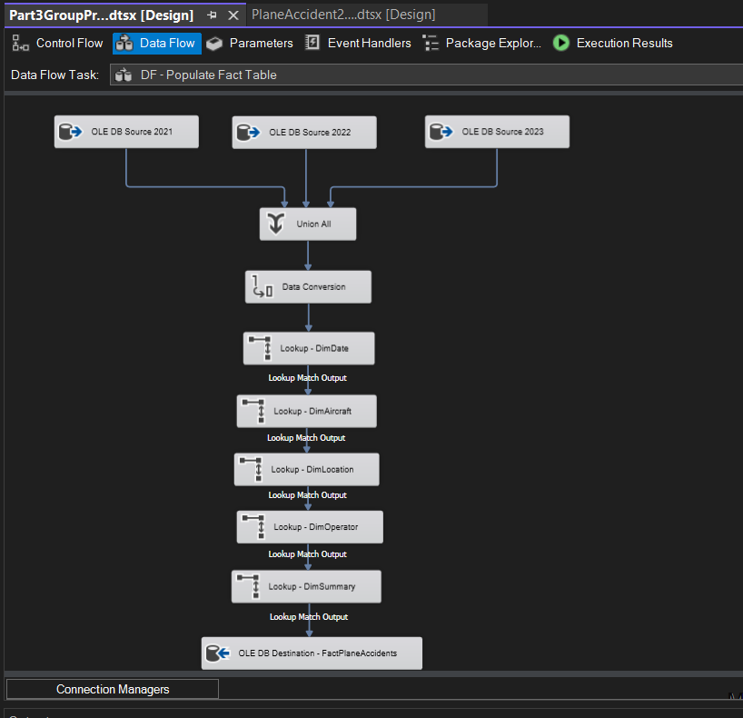

# Aviation-Accident-Data-Warehouse
A Data Warehousing project focusing on profiling, designing, and developing a Star Schema for aviation accident data (2021-2023) using SQL and ETL processes.

# Aviation Accident Data Warehouse & Analysis (2021-2023)

## 📌 Project Overview
This project focuses on the end-to-end development of a Data Warehouse designed to analyze aviation accident data from 2021 to 2023. The goal is to provide a centralized repository for safety analysts and investigators to identify trends, fatality rates, and operational risks across different aircraft types and operators.

### Key Objectives:
* **Data Profiling:** Conducted thorough data quality assessments to identify missing values, data types, and distribution patterns.
* **Dimensional Modeling:** Designed a robust Star Schema (Fact and Dimension tables) to optimize query performance.
* **ETL Engineering:** Developed a structured Extract, Transform, and Load (ETL) process to clean and migrate raw data into the warehouse.

---

## 🛠 Tech Stack
* **Database:** Microsoft SQL Server / MySQL (Specify your DB)
* **Modeling Tool:** (e.g., MySQL Workbench, Draw.io, or LucidChart)
* **ETL Process:** SQL Scripts / SSIS / Python (Specify tools used)
* **Documentation:** Google Docs & Technical Reports

---

## 🏗 Project Architecture

### 1. Data Profiling & Quality Assessment
Before modeling, the raw data underwent rigorous profiling. Key metrics analyzed included:
* **Value Analysis:** Checking for outliers in fatality counts and injury reports.
* **Null Ratio Analysis:** Identified columns with high missing data (e.g., specific weather conditions or non-critical aircraft specs).
* **Data Consistency:** Ensuring uniform naming conventions for aircraft operators and geographical locations.

### 2. Dimensional Modeling (Star Schema)
The data warehouse is built on a Star Schema design to facilitate easy reporting and high-speed aggregation.

* **Fact Table:** `FactPlaneAccidents` (Contains measurable data like Total Fatalities, Serious Injuries, and Damage Cost).
* **Dimension Tables:**
    * `DimDate`: Temporal analysis (Year, Quarter, Month, Day).
    * `DimAircraft`: Aircraft type, model, and engine details.
    * `DimOperator`: Commercial vs. private operators and airline names.
    * `DimLocation`: Geographical data including country, city, and airport codes.

### 3. ETL Process
The ETL pipeline ensures that only clean, transformed data enters the warehouse:
1.  **Extract:** Sourcing raw accident records from disparate CSV/Excel/SQL sources.
2.  **Transform:** * Standardizing date formats.
    * Handling NULL values (imputation or exclusion).
    * Mapping categorical data for the dimension tables.
3.  **Load:** Incremental loading into the production Data Warehouse.

---

## 📊 Key Performance Indicators (KPIs)
The warehouse is optimized to calculate the following safety metrics:
* **Fatality Rate:** Total fatalities per 100 accidents.
* **Incident Density:** Accidents mapped by geographical region.
* **Operator Risk Profile:** Comparing accident frequencies between commercial and private aviation.
* **Aircraft Reliability:** Identifying specific aircraft models with recurring technical failures.

---
